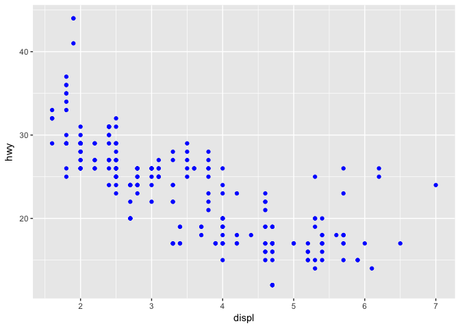

# Week3_Assignment


```r
mpg.data <- ggplot2::mpg
head(mpg.data)
```

```
## # A tibble: 6 × 11
##   manufacturer model displ  year   cyl      trans   drv   cty   hwy    fl
##          <chr> <chr> <dbl> <int> <int>      <chr> <chr> <int> <int> <chr>
## 1         audi    a4   1.8  1999     4   auto(l5)     f    18    29     p
## 2         audi    a4   1.8  1999     4 manual(m5)     f    21    29     p
## 3         audi    a4   2.0  2008     4 manual(m6)     f    20    31     p
## 4         audi    a4   2.0  2008     4   auto(av)     f    21    30     p
## 5         audi    a4   2.8  1999     6   auto(l5)     f    16    26     p
## 6         audi    a4   2.8  1999     6 manual(m5)     f    18    26     p
## # ... with 1 more variables: class <chr>
```

```r
colnames(mpg.data)
```

```
##  [1] "manufacturer" "model"        "displ"        "year"        
##  [5] "cyl"          "trans"        "drv"          "cty"         
##  [9] "hwy"          "fl"           "class"
```

#PLot the displ on the x-axis and hwy on the y-axis

```r
#install.packages("ggplot")
library(ggplot2)
ggplot(data = mpg.data) +
  geom_point(mapping = aes(x = displ, y = hwy))
```

<!-- -->
#3.2.4 Exercises

```r
#Excercise 1
ggplot(data = mpg)
```

<!-- -->

```r
#you see nothing. Just empty graph

#Excercise 2
#How many rows are in mtcars? How many columns?
dim(mtcars)
```

```
## [1] 32 11
```

```r
#[1] 32 rows and 11 columns
```


```r
#Excercise 3
#What does the drv variable describe? Read the help for ?mpg to find out
?mpg
#It shows the wheel drive
#f = front-wheel drive, r = rear wheel drive, 4 = 4wd
```


```r
#Excercise 4
#Make a scatterplot of hwy vs cyl
ggplot(data = mpg) +
  geom_point(mapping = aes(x = cyl, y =hwy))
```

<!-- -->


```r
#Excercise 5:
#What happens if you make a scatterplot of class vs drv. Why is the plot not useful?
ggplot(data = mpg) +
  geom_point(mapping = aes(x = class, y = drv))
```

<!-- -->


```r
ggplot(data = mpg) +
  geom_point(mapping = aes(x = displ, y = hwy, color = class))
```

<!-- -->

#3.3.1 Exercises

```r
# 1) What’s gone wrong with this code? Why are the points not blue?
ggplot(data = mpg) +
  geom_point(mapping = aes(x = displ, y = hwy, color = "blue"))
```

<!-- -->

```r
#because it is in the aes() function. For manual assignment of colors the assignment should be its own function
ggplot(data =mpg) +
  geom_point(aes(x = displ, y = hwy), color = "blue")
```

<!-- -->


```r
# 2) Which variables in mpg are categorical? Which variables are continuous? (Hint: type ?mpg to read the documentation for the dataset). How can you see this information when you run mpg?
#colnames(mpg)
summary(mpg)
```

```
##  manufacturer          model               displ            year     
##  Length:234         Length:234         Min.   :1.600   Min.   :1999  
##  Class :character   Class :character   1st Qu.:2.400   1st Qu.:1999  
##  Mode  :character   Mode  :character   Median :3.300   Median :2004  
##                                        Mean   :3.472   Mean   :2004  
##                                        3rd Qu.:4.600   3rd Qu.:2008  
##                                        Max.   :7.000   Max.   :2008  
##       cyl           trans               drv                 cty       
##  Min.   :4.000   Length:234         Length:234         Min.   : 9.00  
##  1st Qu.:4.000   Class :character   Class :character   1st Qu.:14.00  
##  Median :6.000   Mode  :character   Mode  :character   Median :17.00  
##  Mean   :5.889                                         Mean   :16.86  
##  3rd Qu.:8.000                                         3rd Qu.:19.00  
##  Max.   :8.000                                         Max.   :35.00  
##       hwy             fl               class          
##  Min.   :12.00   Length:234         Length:234        
##  1st Qu.:18.00   Class :character   Class :character  
##  Median :24.00   Mode  :character   Mode  :character  
##  Mean   :23.44                                        
##  3rd Qu.:27.00                                        
##  Max.   :44.00
```


```r
# 3) Map a continuous variable to color, size, and shape. How do these aesthetics behave differently for categorical vs. continuous variables?
ggplot(data = mpg) +
  geom_point(mapping = aes(x = displ, y = year, color = hwy))
```

<!-- -->

```r
#how do they behave differently??Ask in the class
```


```r
# 4) What happens if you map the same variable to multiple aesthetics?
ggplot(data = mpg) +
  geom_point(mapping = aes(x = displ, y = hwy, color = hwy))
```

<!-- -->

```r
# I think it shows the values. Nothing wrong with it. 
```


```r
# 5) What does the stroke aesthetic do? What shapes does it work with? (Hint: use ?geom_point)
?geom_point
ggplot(data = mpg) +
  geom_point(mapping = aes(x = displ, y = hwy, color = cyl, stroke = 2))
```

<!-- -->

```r
#stroke assigns the width of the border of the shape
```


```r
# 4)What happens if you map an aesthetic to something other than a variable name, like aes(colour = displ < 5)?
ggplot(data = mpg) +
  geom_point(mapping = aes(x = cyl, y = hwy, color = displ < 5))
```

<!-- -->

```r
#returns a TRUE or FALSE value
```

# 3.5 Facets


```r
ggplot(data = mpg) +
  geom_point(mapping = aes(x = displ, y = hwy)) +
  facet_wrap(~ class, nrow = 1)
```

<!-- -->


```r
ggplot(data = mpg) + 
  geom_point(mapping = aes(x = displ, y = hwy)) + 
  facet_grid(drv ~ cyl)
```

<!-- -->

#3.5.1 Exercises


```r
# 1)What happens if you facet on a continuous variable?
ggplot(data = mpg) +
  geom_point(mapping = aes(x = displ, y = cyl)) +
  facet_wrap(~ hwy)
```

<!-- -->

```r
#Becomes too complicated since it makes a figure for each data
```


```r
# 2) What do the empty cells in plot with facet_grid(drv ~ cyl) mean? How do they relate to this plot?
ggplot(data = mpg) + 
  geom_point(mapping = aes(x = drv, y = cyl))
```

<!-- -->

```r
#Don't know the answer
```


```r
ggplot(data = mpg) + 
  geom_point(mapping = aes(x = displ, y = hwy)) +
  facet_grid(. ~ cyl)
```

<!-- -->


